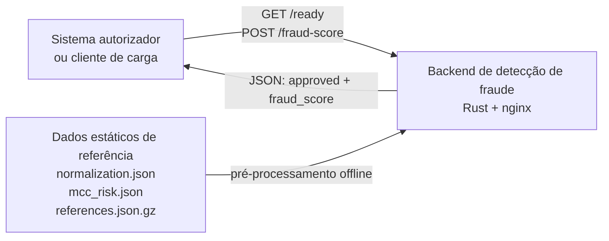
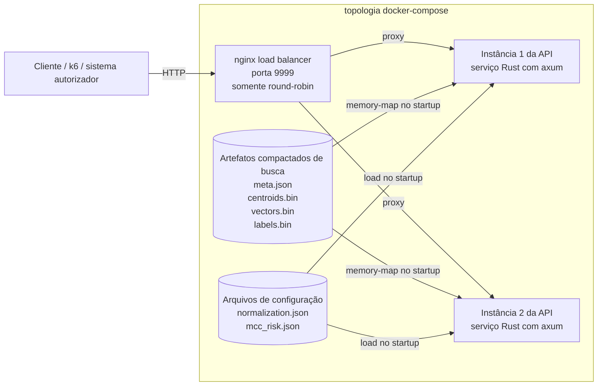
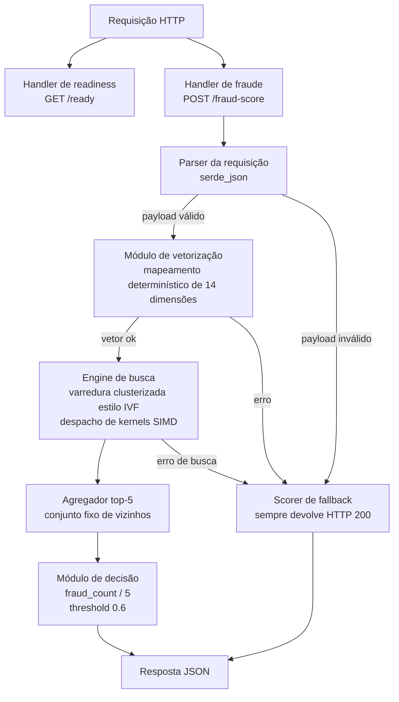
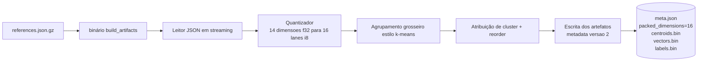
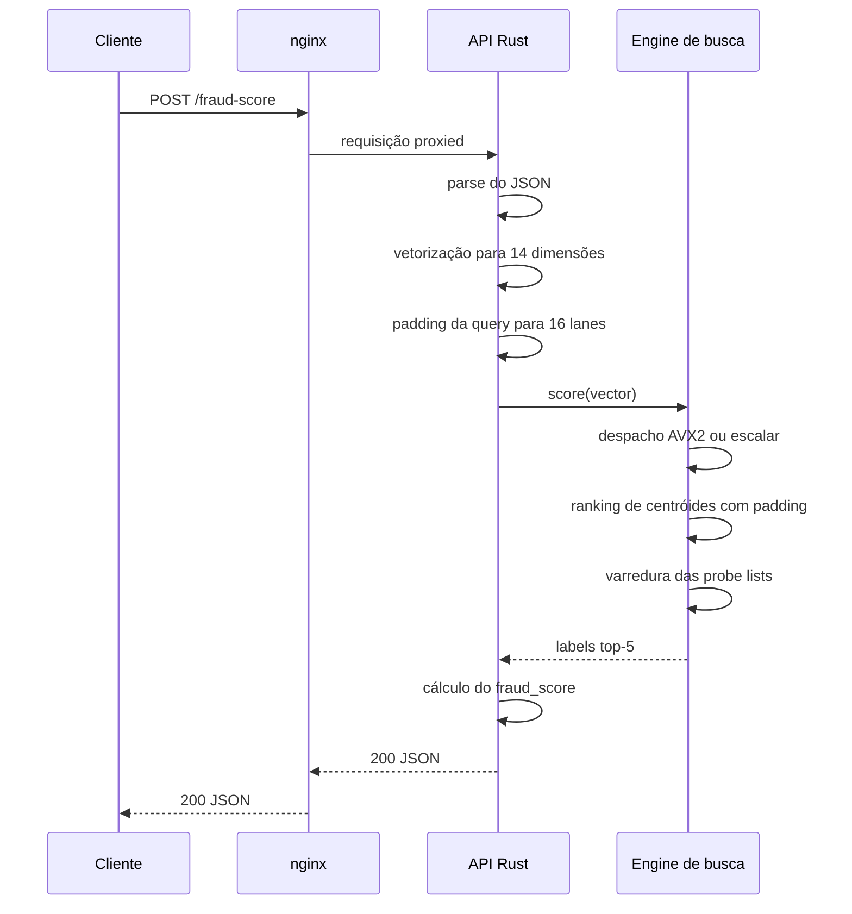

# Implementação em C4

Este documento descreve a implementação Rust atual adicionada neste repositório, e não apenas a topologia genérica da competição. O foco aqui é a composição real de runtime, os componentes internos da API e o pipeline offline que prepara os dados de busca vetorial.

Arquivos relevantes:

- [`docker-compose.yml`](../../docker-compose.yml)
- [`nginx.conf`](../../nginx.conf)
- [`src/bin/server.rs`](../../src/bin/server.rs)
- [`src/lib.rs`](../../src/lib.rs)
- [`src/search.rs`](../../src/search.rs)
- [`src/bin/build_artifacts.rs`](../../src/bin/build_artifacts.rs)

## Nível 1: Contexto do Sistema

### Notas

- O backend é um sistema isolado de score de fraude. Ele recebe o payload da transação e devolve a decisão.
- O dataset grande de referência não é consultado como JSON bruto em tempo de requisição. Ele é transformado em artefatos compactos antes da API começar a servir tráfego.

## Nível 2: Diagrama de Containers

### Notas

- O `nginx` não executa lógica de negócio. Ele apenas encaminha requisições para as duas instâncias upstream.
- Cada instância da API carrega o mesmo conjunto de artefatos read-only e responde de forma independente.
- As instâncias da API não dependem de banco externo, cache ou vector store no hot path.

## Nível 3: Diagrama de Componentes da API

### Responsabilidades dos componentes

- **Parser da requisição**: desserializa o corpo JSON de entrada para os DTOs Rust.
- **Módulo de vetorização**: aplica o mapeamento exato das 14 dimensões definido no desafio, incluindo extração UTC de hora/dia, sentinelas `-1` para ausência de última transação, clamp e fallback de MCC.
- **Engine de busca**: faz padding e quantização do vetor da requisição, ranqueia centróides grosseiros, percorre um número limitado de listas invertidas e calcula distância Euclidiana quadrática sobre vetores compactados.
- **Despacho de kernels SIMD**: seleciona kernels `AVX2` no startup em `x86_64` quando disponíveis; caso contrário, usa as implementações escalares.
- **Agregador top-5**: mantém os cinco candidatos mais próximos sem precisar alocar uma estrutura grande para ordenar tudo.
- **Módulo de decisão**: converte os cinco rótulos em `fraud_score` e `approved`.
- **Scorer de fallback**: devolve JSON válido em caminhos degradados para evitar respostas não-200 durante a pontuação.

## Nível 4: Pipeline de Construção dos Artefatos

### Notas

- O builder processa o array gzipado em streaming e não exige um JSON expandido no runtime.
- Os vetores são quantizados das 14 dimensões lógicas para 16 lanes de bytes assinados; as 2 lanes finais ficam zeradas para favorecer cargas SIMD.
- Os centróides também são gravados como registros de 16 lanes, com as 2 lanes finais de `f32` zeradas.
- O `meta.json` agora carrega `version = 2` e `packed_dimensions = 16`, fazendo com que artefatos antigos falhem rapidamente em vez de serem carregados de forma incorreta.
- O armazenamento reordenado por cluster mantém cada lista invertida contígua, o que torna a leitura por probe mais sequencial e amigável ao cache.

## Ciclo de Vida da Requisição

## Intenção do Design

- Manter o caminho da requisição autocontido e somente leitura após o startup.
- Empurrar o trabalho pesado do dataset para uma etapa offline de build.
- Fazer padding de vetores e centróides para 16 lanes para permitir cargas SIMD simples no runtime, sem lógica de cauda para registros de 14 dimensões.
- Preferir respostas `200` com JSON válido a expor erros do caminho de requisição.
- Manter a topologia de runtime compatível com a exigência da competição de um load balancer e duas instâncias de API.

[← README em português](./README.md)
