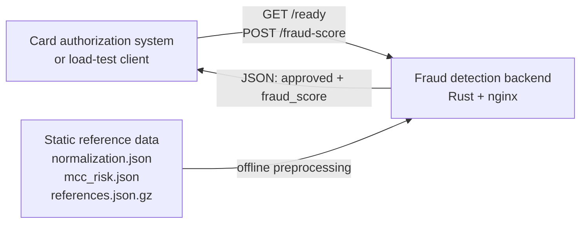
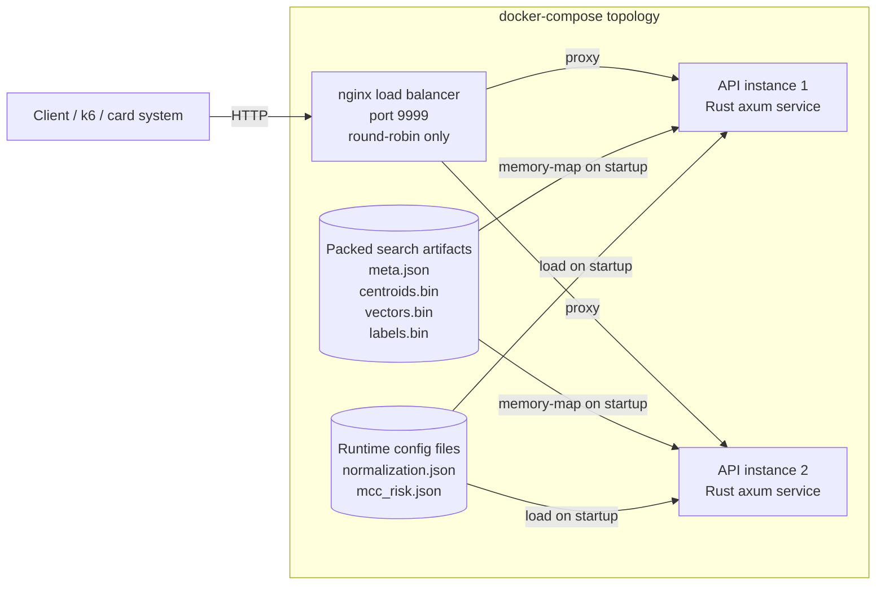
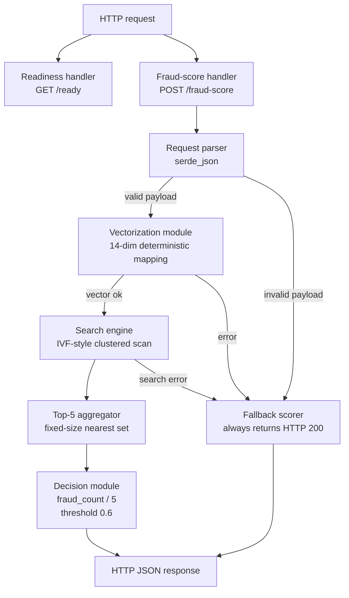
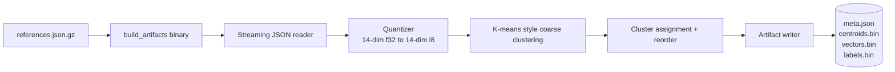
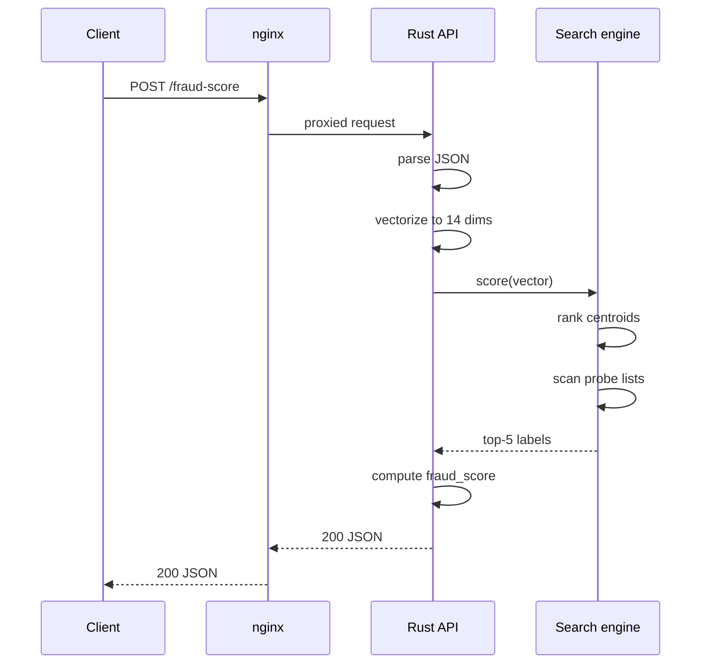

# Implementation C4

This document describes the current Rust implementation added in this repository, not the generic competition topology. It focuses on the concrete runtime services, the internal components of the API, and the offline artifact pipeline that prepares the vector-search data.

Relevant source files:

- [`docker-compose.yml`](../../docker-compose.yml)
- [`nginx.conf`](../../nginx.conf)
- [`src/bin/server.rs`](../../src/bin/server.rs)
- [`src/lib.rs`](../../src/lib.rs)
- [`src/search.rs`](../../src/search.rs)
- [`src/bin/build_artifacts.rs`](../../src/bin/build_artifacts.rs)

## Level 1: System Context

### Notes

- The backend is an isolated fraud-scoring system. It receives transaction payloads and returns a decision.
- The large reference dataset is not queried as raw JSON at request time. It is transformed into compact artifacts before the API starts serving traffic.

## Level 2: Container Diagram

### Notes

- `nginx` performs no business logic. It only forwards requests to the two upstream API containers.
- Each API instance loads the same read-only artifact set and answers requests independently.
- The API containers do not depend on an external database, cache, or vector store in the hot path.

## Level 3: API Component Diagram

### Component responsibilities

- **Request parser**: deserializes the incoming JSON body into the Rust DTOs.
- **Vectorization module**: applies the exact 14-dimension mapping from the challenge rules, including UTC hour/day extraction, `-1` sentinels for missing last-transaction fields, clamping, and MCC fallback.
- **Search engine**: quantizes the request vector, ranks coarse centroids, probes a bounded number of inverted lists, and computes squared Euclidean distance over packed vectors.
- **Top-5 aggregator**: maintains the current nearest five candidates without allocating a large sortable structure.
- **Decision module**: converts the five labels into `fraud_score` and `approved`.
- **Fallback scorer**: returns valid JSON on degraded paths so the system avoids non-200 responses during scoring.

## Level 4: Artifact Build Pipeline

### Notes

- The builder streams the gzipped reference array and does not require a raw expanded JSON file in the runtime image.
- Vectors are quantized to signed bytes so the API can store and scan them more compactly.
- Reordered per-cluster storage keeps each inverted list contiguous, which makes probe scans sequential and cache-friendlier.

## Request Lifecycle

## Design Intent

- Keep the request path self-contained and read-only after startup.
- Move heavy dataset work into an offline build step.
- Prefer valid `200` JSON responses over surfacing request-path errors.
- Keep the runtime topology compliant with the competition requirement of one load balancer plus two API instances.

[← English README](./README.md)
